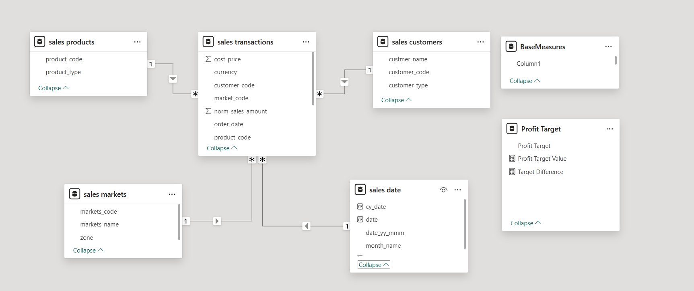
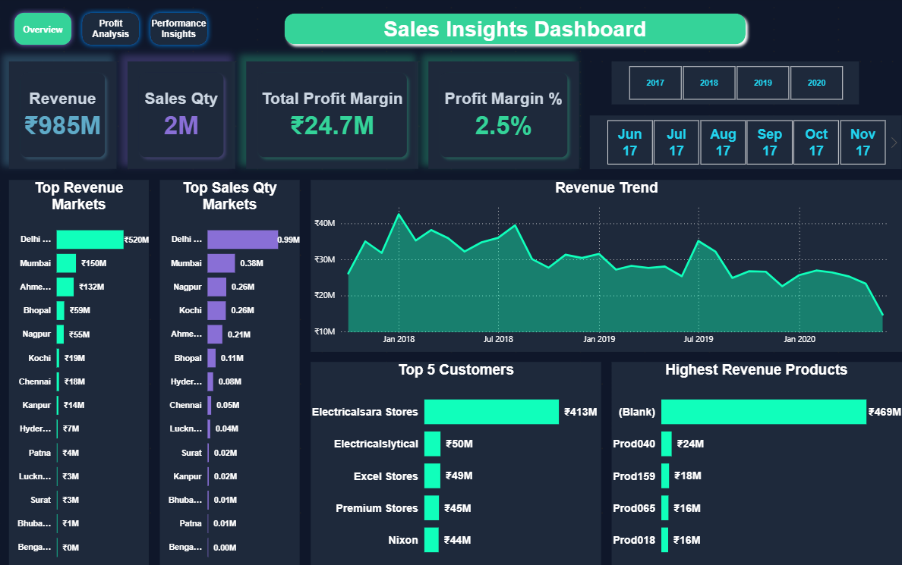
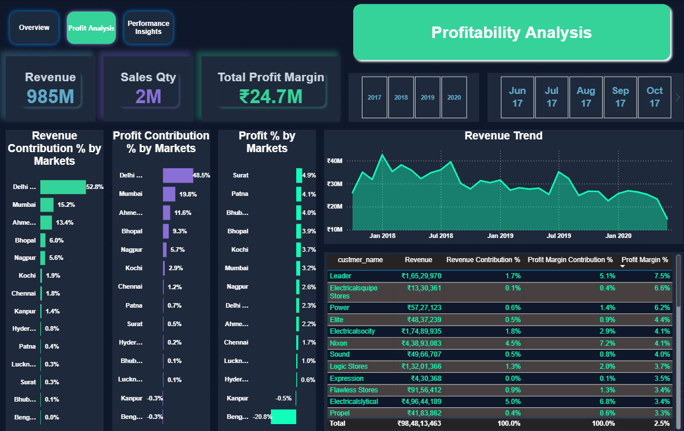
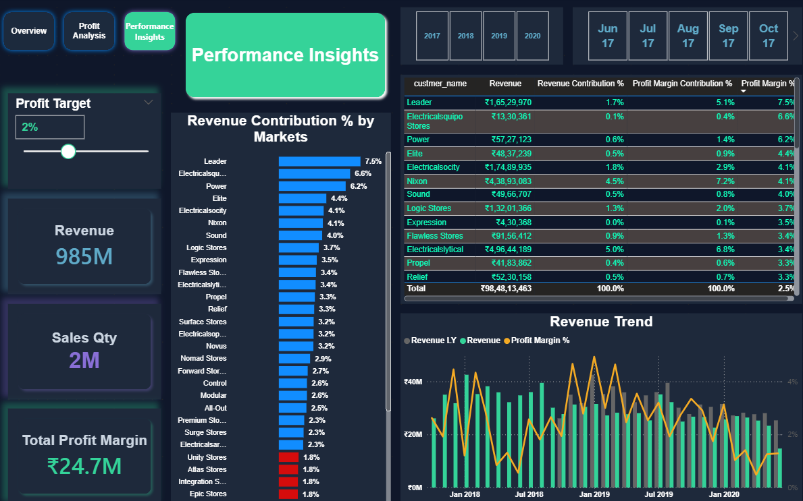

# Sales Insights Power BI Dashboard

## 📌 Project Overview

This project is an interactive **Business Intelligence dashboard** built in Power BI to analyze sales performance, revenue trends, and profitability across different markets and customer segments.

It helps identify key business patterns through dynamic visualizations and data-driven insights.

---

---
🔗 Live Dashboard Link

👉 [Click here to view the Dashboard](your-dashboard-link)

---

## 🎯 Business Objectives

- Analyze overall sales and revenue performance.
- Track yearly sales trends.
- Identify high-performing and low-performing regions.
- Monitor profit trends across different markets.
- Support data-driven business decision-making.

---

## 🛠️ Tech Stack

- Power BI
- MySQL
- SQL
- Power Query
- DAX

---

## 📘 Skills Demonstrated

- Data Cleaning
- Data Modeling
- DAX Calculations
- Dashboard Design
- Data Visualization
- Business Analysis
- Insight Generation

---

## 🧩 Data Model

The dashboard is built using relational data modeling in Power BI with multiple connected tables for sales analysis.

---

## 🧮 DAX Measures

The report uses DAX measures to calculate and analyze core business metrics such as revenue, profit margin, and sales quantity.

### Example Measures
- Total Revenue
- Total Sales Quantity
- Profit Margin %
- Total Profit

These measures are used throughout the dashboard to create KPI cards, charts, and trend analysis.

---

# 📷 Dashboard Pages

---

## 🏠 Overview Dashboard

This page gives a high-level view of sales performance, revenue trends, and market-wise analysis.

### Key Highlights
- Revenue, sales quantity, and profit margin KPIs.
- Top-performing markets by revenue and sales quantity.
- Revenue trend analysis over time.
- Top customers and highest revenue-generating products.

---

## 📈 Profitability Analysis Dashboard

This page focuses on market-wise profitability and profit contribution analysis.

### Key Highlights
- Profit contribution by market.
- Profit percentage analysis.
- Revenue trend visualization.
- Customer-wise profitability insights.

---

## 🚀 Performance Insights Dashboard

This page provides deeper business insights using contribution and trend analysis.

### Key Highlights
- Revenue contribution percentage by market.
- Customer contribution analysis.
- Profit margin trend analysis.
- Comparative revenue performance insights.

---

## 🔍 Key Insights

- Total business revenue reached approximately **₹985M**, with an overall profit margin of **2.5%** and total profit of nearly **₹24.7M**.
- **Delhi NCR** was the highest-performing market, contributing around **₹520M** in revenue and nearly **52.8%** of total revenue.
- **Delhi NCR** and **Mumbai** together contributed more than **68%** of total business revenue, showing heavy dependence on a few key markets.
- **Surat** recorded the highest profit margin percentage at approximately **4.9%**, while some markets like **Bengaluru** and **Kanpur** showed very low or negative profit contribution.
- Monthly revenue peaked above **₹40M** during early **2018**, followed by fluctuating revenue trends and a gradual decline toward 2020.

---

## 💡 Business Recommendations

- Focus on improving profit margins in low-performing markets.
- Increase investment in high-revenue regions.
- Monitor loss-making areas to reduce operational inefficiencies.
- Use trend analysis for better sales forecasting and planning.

---

## 📘 Learnings

- Connected a MySQL database with Power BI.
- Performed data cleaning and transformation using Power Query.
- Improved understanding of data modeling and table relationships.
- Created DAX measures for revenue, profit margin, and sales quantity.
- Designed interactive dashboards using slicers and filters.
- Improved dashboard design and data storytelling skills.
- Derived business insights from sales and profitability analysis.

---

## 🚀 How to Use

1. Open the Power BI dashboard.
2. Use the year slicer to filter the data.
3. Navigate across dashboard pages.
4. Analyze revenue and profit trends.
5. Explore market-wise insights.

---

## 📬 Feedback

If you have any suggestions or feedback, feel free to connect with me on LinkedIn.

👉 [Connect with me on LinkedIn](https://www.linkedin.com/in/aman-chaudhary-4b2459236/)
